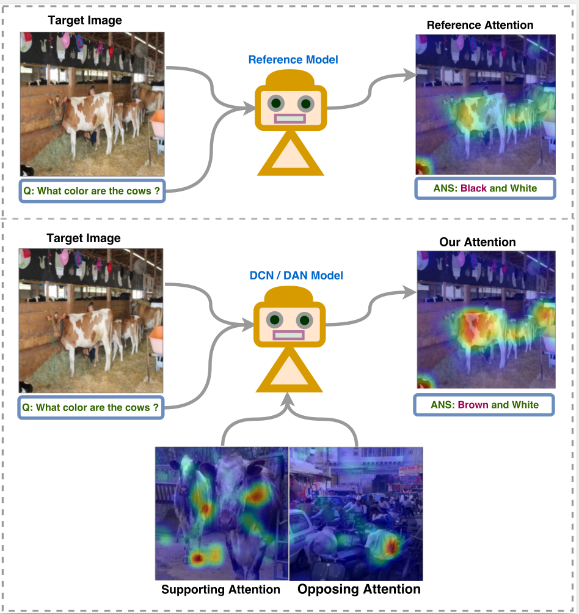
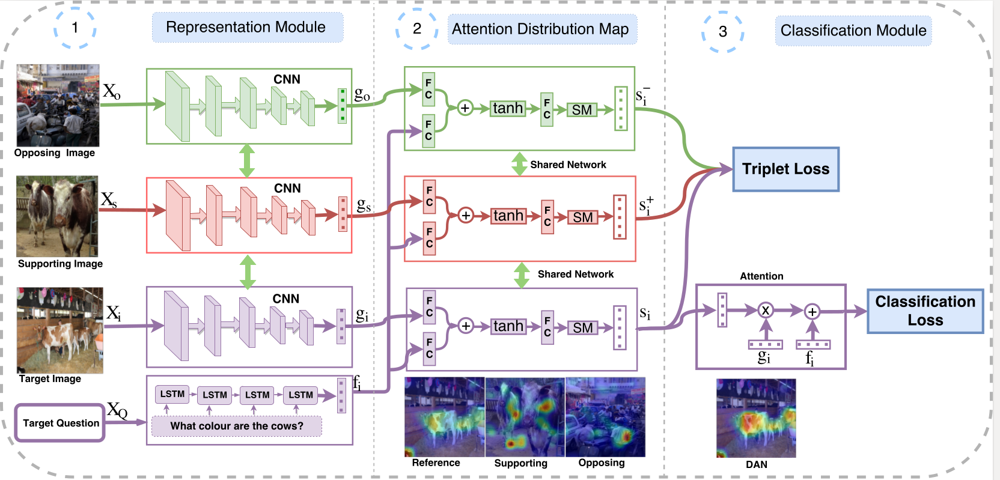
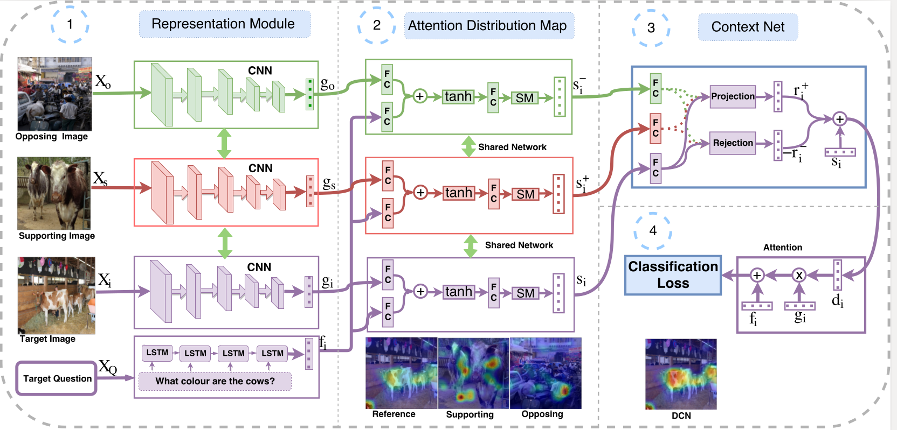
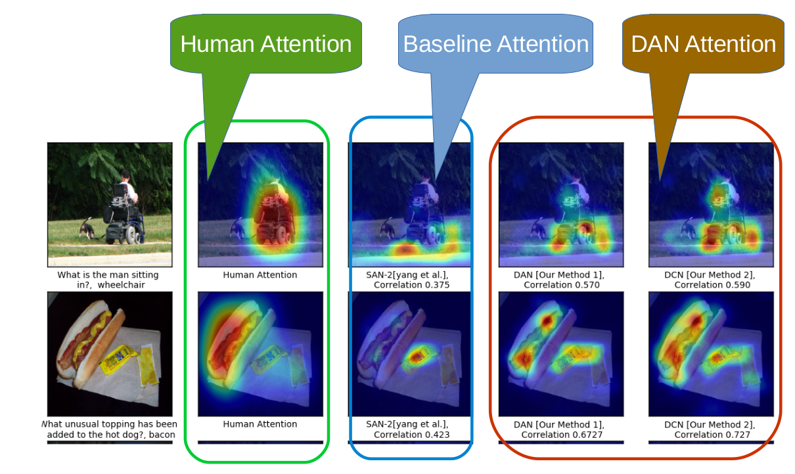

## Differential Attention for Visual Question Answering
Badri Patro,Vinay P. Namboodiri


###Motivation
-   We adopt an exemplar based approach to improve visual question answering (VQA) methods by providing a differential attention
-   We evaluate two variants for obtaining differential attention - one where we only obtain attention and the other where we obtain differential context in addition to attention
-    We show that this method correlates better with human attention and results in an improved visual question answering that improves the state-of-the-art for image based attention methods. It is also competitive with respect to other proposed methods for this problem.
###Introduction
 
###VQA Models
####DAN Model 
 
####DCN Model 
 


###Results
 


# Header 1
## Header 2
### Header 3

- Bulleted
- List

1. Numbered
2. List

**Bold** and _Italic_ and `Code` text

[Link](url) and 
```

