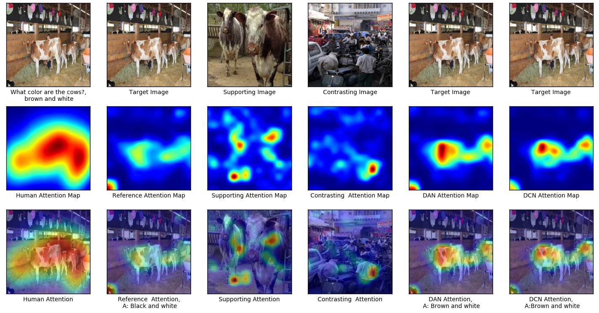
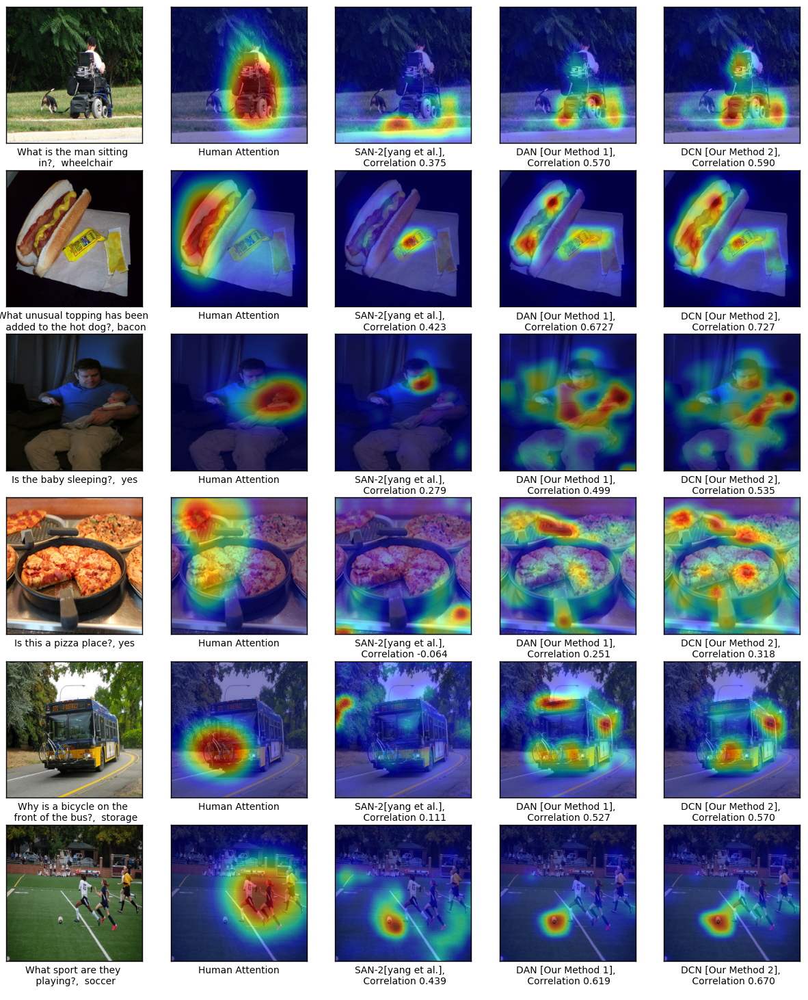
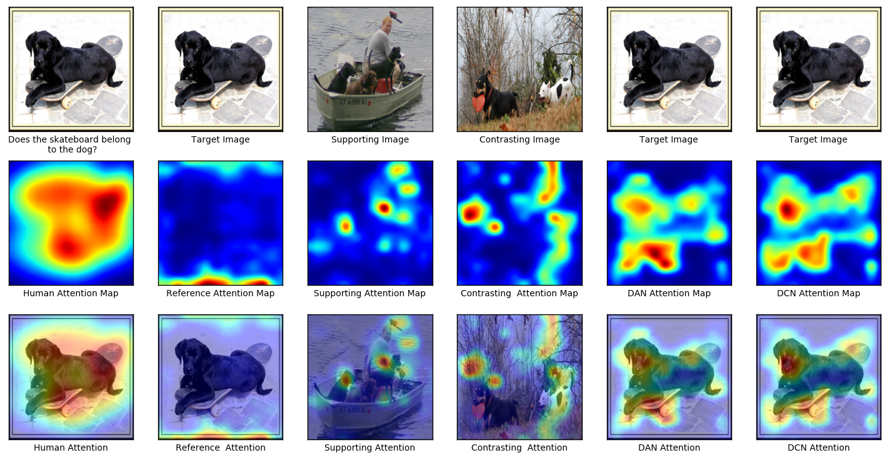
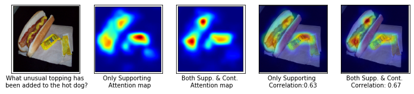
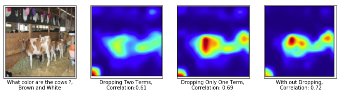
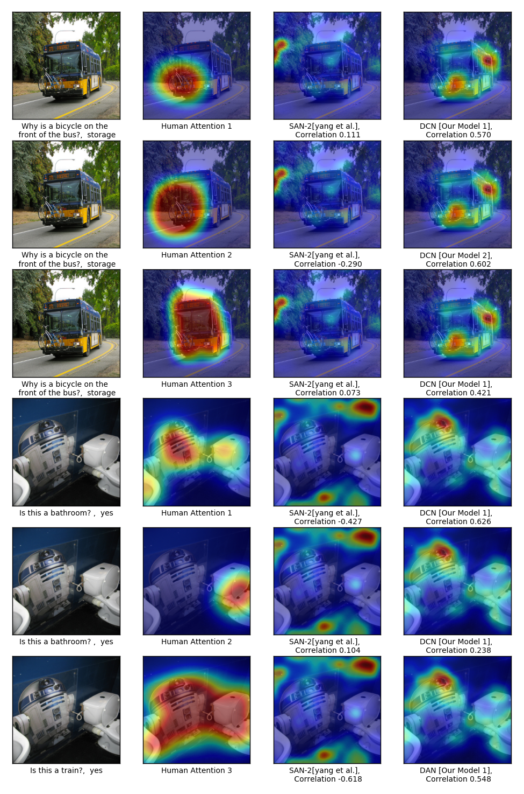
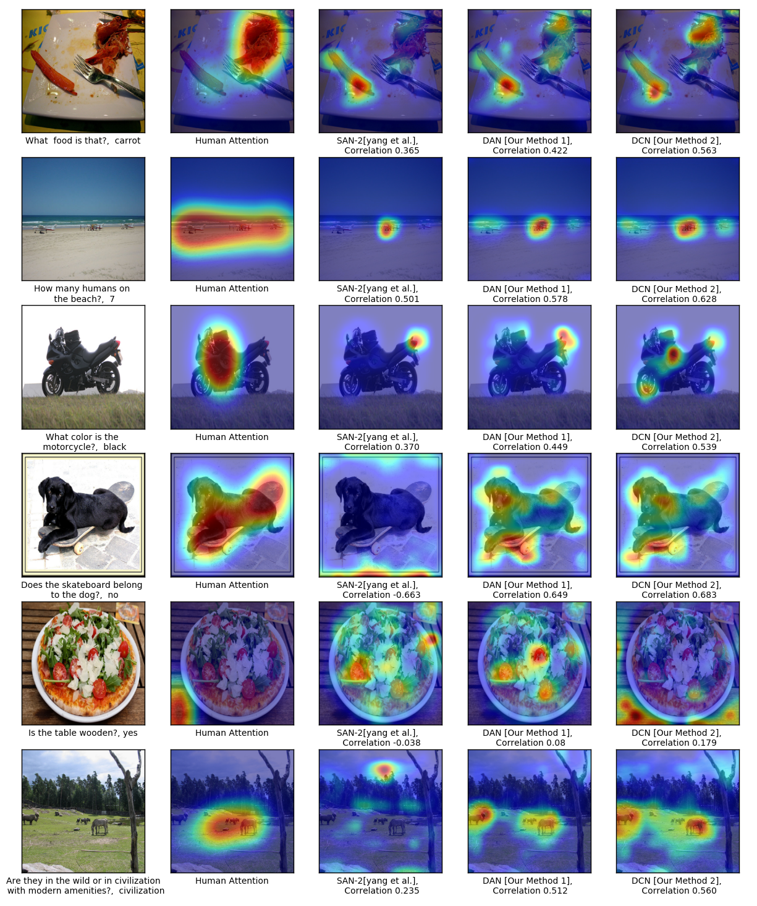
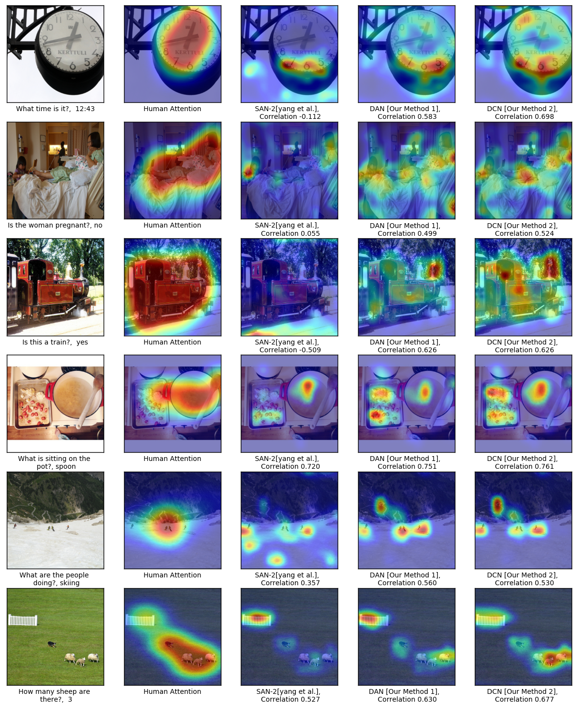

## Differential Attention for Visual Question Answering
Badri Patro,Vinay P. Namboodiri
### Abstract
In this paper we aim to answer questions based on images when provided with a dataset of question-answer pairs for a number of images during training. A number of methods have focused on solving this problem by using image based attention. This is done by focusing on a specific part of the image while answering the question. Humans also do so when solving this problem. However, the regions that the previous systems focus on are not correlated with the regions that humans focus on. The accuracy is limited due to this drawback. In this paper, we propose to solve this problem by using an exemplar based method. We obtain one or more supporting and opposing exemplars to obtain a differential attention region. This differential attention is closer to human attention than other image based attention methods. It also helps in obtaining improved accuracy when answering questions. The method is evaluated on challenging benchmark datasets. We perform better than other image based attention methods and are competitive with other state of the art methods that focus on both image and questions.

### Motivation
-   We adopt an exemplar based approach to improve visual question answering (VQA) methods by providing a differential attention
-   We evaluate two variants for obtaining differential attention - one where we only obtain attention and the other where we obtain differential context in addition to attention
-    We show that this method correlates better with human attention and results in an improved visual question answering that improves the state-of-the-art for image based attention methods. It is also competitive with respect to other proposed methods for this problem.

### Introduction

 

### **VQA Models**

#### DAN Model 

 

#### DCN Model 

 


### Results
 








# Header 1
####  How important are the supporting and contrasting exemplar?
 We carried out an experiment by considering only the supportive exemplar in triplet loss mentioned in equation-2 and obtained consistent result as shown in figure~\ref{fig:a1}. From the rank correlation result, we can conclude that, If we use only the supportive exemplar, we obtain most of the gain in the performance. The quantitative results for this ablation analysis is shown in the table ~\ref{DAN_rank_correlation}, which provides  the rank correlation on HAT Validation Dataset.


Importance of Supporting exemplar vs both. the first column in the figure indicates about image and corresponding question, the second  and third term indicates attention map for supporting exemplar and both supporting and opposing exemplar. The fourth and fifth column gives the value of rank correlation for supporting and both.


#### Contribution of different term in DCN
 We carried out an experiment by dropping the vector projection of $s_i^-$ on $s_i$ term in the supporting context $r_i^+$ as mentioned in equation-3 and the vector rejection of $s_i^+$ on $s_i$ term in opposing context $r_i^-$ as mentioned in equation-4 and obtained consistent result as shown in  figure~\ref{fig:a2}.
 The contribution of these terms in the corresponding equations are very small.The quantitative results for this ablation analysis is shown in the table ~\ref{DCN_rank_correlation}, which provides  the rank correlation on HAT Validation Dataset.

 Ablation Results for Dropping  terms in equation 3 and 4. The first column indicate the target image and its question, The second column provides the attention map \& rank correlation by dropping $2^{nd}$ in equation 3 \& $i^{st}$  term in equation 4. The third column gives the attention map \& rank correlation by dropping only  $i^{st}$  term in equation 4. Final column provides the attention map \& rank correlation by consider every thing in both the equation.


## Header 2



### Header 3



- Bulleted
- List

1. Numbered
2. List

**Bold** and _Italic_ and `Code` text

[Link](url) and 
```

